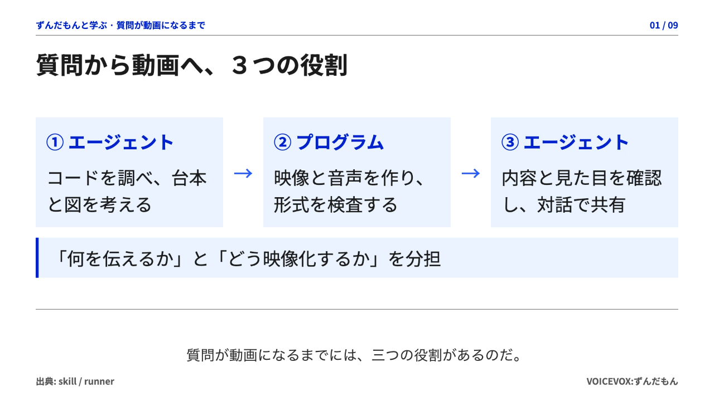

# dopagaki-wiki

**質問やソースコードを、ずんだもんの解説動画に。**

根拠のある原稿・図解・音声・字幕を組み合わせた動画を作る、macOS向けの Agent Skill とローカル CLI です。エージェントが調査と原稿を担当し、CLIが検証と映像化を担当します。

## デモ：質問が動画になるまで

[](./docs/generation/0.0.1/20260908T225140Z-repository-walkthrough/video.mp4)

**[動画を見る（約3分）](./docs/generation/0.0.1/20260908T225140Z-repository-walkthrough/video.mp4)** — エージェントとプログラムの役割、生成・検査の流れ、台本を直したときの再利用を図解しています。[台本と評価記録](./docs/generation/0.0.1/20260908T225140Z-repository-walkthrough/README.md)

- **理解しやすさを優先** — デジタル庁の青とニュートラル色を使い、文字・図・字幕の読みやすさを揃えます。
- **別のリポジトリでも使える** — グローバルSkillから対象のコードを調べ、成果物は `/tmp` に作って対話で共有します。
- **修正して作り直せる** — 音声やスライドをキャッシュし、変更した部分に応じて再生成します。

## 使い始める

Node.js・FFmpeg・VOICEVOXを [セットアップ手順](docs/setup.md) に沿って準備し、このリポジトリで実行します。

```sh
npm ci
npm run setup
npm run cli -- doctor --start-voicevox
npm run skill:install
```

Skillを読み込んだタスクで、説明してほしい内容を依頼します。

```text
$dopagaki-wiki このリポジトリの認証処理をソースコードから調べて、ずんだもんの解説動画にして
```

生成した台本・画像・動画は通常Git管理せず、対話に動画とリンクを返します。CLIで直接生成する手順は [使い方](docs/usage.md) を参照してください。

## サンプル

[Goの整数型を説明する動画と評価記録](docs/generation/0.0.1/README.md) — int8・int16・int32・int64とuintの違いを、16スライド・6分8秒で説明します。

出力は横長16:9、1920×1080、30fpsのMP4です。この初期記録は当時の緑の配色を保持しています。現在の青のテーマは [DESIGN.md](DESIGN.md) で管理しています。

## ドキュメント

| 知りたいこと | ガイド |
| --- | --- |
| 必要な環境、Node.jsの管理、Skillの登録 | [セットアップ](docs/setup.md) |
| 依頼の仕方、CLI、出力ファイル、再生成 | [使い方](docs/usage.md) |
| テスト、E2E、動画の品質確認 | [開発と検証](docs/development.md) |
| 配色、書体、レイアウト、図・画像のルール | [DESIGN.md](DESIGN.md) |
| 生成の流れと実装の入口 | [生成の仕組み](docs/architecture.md) |
| 変更前後の比較と、評価記録のGit保存 | [比較記録の保存ルール](docs/generation/README.md) |

エージェント向けの作業手順は [SKILL.md](skills/dopagaki-wiki/SKILL.md)、当初の設計意図は [実装プラン](docs/implementation-plan.md) にまとめています。
