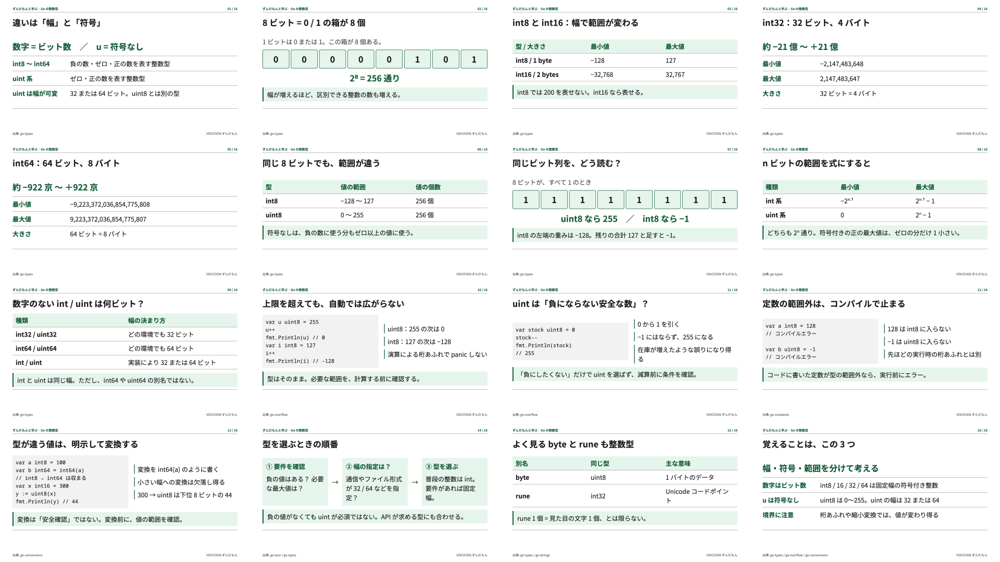

# 0.0.1 — Go の整数型を、ずんだもんと理解する

[動画を再生・ダウンロード](video.mp4) · [スライド一覧と原稿](preview.html) · [品質評価](quality-review.md) · [実装・判断](decisions.md)

<video src="video.mp4" controls playsinline width="960"></video>

質問: 「Go の int8, int16, int32, int64 は何か。uint との差はなにかを説明して欲しい」

- 横長16:9、1920×1080、30fps、H.264/AAC
- 16スライド、61文、6分8秒
- 動画 16,202,515 bytes（約16.2MB / 15.5MiB）。Git LFSを必要とするサイズではないため、MP4をGitに含めた
- ずんだもん（ノーマル）、デジタル庁デザインシステムに準拠した書体・配色・コントラスト
- 初回57.314秒、再実行7.847秒。原稿完成後のCLI実行時間。調査・原稿作成・依存導入・音声認識モデルの初回ダウンロード・内容レビューは含めない



## 保存したもの

| ファイル | 再評価での用途 |
|---|---|
| video.mp4 | 映像・音声・字幕の基準となる完成動画 |
| story.json / script.md / evidence.json | 質問・学習項目・原稿・参照した公式資料 |
| slides/ / preview.html | 固定レイアウトのHTMLとPNG、同梱フォントとライセンス |
| timeline.json / subtitles.srt / subtitles.ass | 実音声から計算した共通時刻と字幕 |
| manifest.json / layout-report.json / validation.json | 実装・原稿・動画ハッシュ、実行条件、機械検査 |
| benchmark.json / cache-check.json | 初回・再実行・差分修正・破損復旧の実測 |
| go-verification.json | 実行したGo例とコンパイルエラーの検証 |
| review/ | 実映像の代表フレーム、63箇所の字幕検査、音響・読み・ASR、ブラウザー再生 |
| probes/ | 2進数のSVG例と、リポジトリの時間管理説明の試作記録 |

約35MBの中間PCM、キャッシュ、字幕検査用の63枚の切り抜き画像は含めていない。元データと手順から再生成でき、比較に必要な結果と代表画像を保存した。

## 再生成

現在の依存導入手順は [リポジトリのREADME](../../../README.md)、新しい比較記録の配置は [保存ルール](../README.md) を参照。リポジトリのルートで以下を実行する。比較のため、既存の0.0.1ディレクトリを直接上書きしない。

```sh
npm ci
npm run setup
npm run cli -- doctor --start-voicevox
workdir=$(mktemp -d /tmp/dopagaki-wiki.XXXXXX)
npm run cli -- render docs/generation/0.0.1/story.json --out "$workdir/result"
node scripts/contact-sheet.mjs "$workdir/result"
node scripts/playback-check.mjs "$workdir/result"
./node_modules/.bin/tsx scripts/subtitle-check.ts "$workdir/result"
```

VOICEVOX ENGINE 0.25.1、コア/話者モデル0.16.1で生成。エンジンやモデルが変わると音声や尺は変わり得る。現時点のエンジンを再配布してはいない。

## 次のバージョンを評価する

1. 同じ質問・同じstory.jsonを使って、変更の前後を比較する。原稿を変える場合はその差分も残す。
2. `quality-review.md` の5つの説明項目、数値・コードの検算、字幕・図の見やすさ、用語の読みを同じ基準で確認する。
3. スライド一覧、字幕付き代表フレーム、音量、正確なフレーム数、生成時間、キャッシュ再利用率を並べる。
4. 実装commit、storySha256、videoSha256、ツール/エンジン、ハードウェアを記録する。
5. 視聴者テストや別モデルでの生成を行った場合は、その結果を追加する。実施していない評価を合格にしない。
